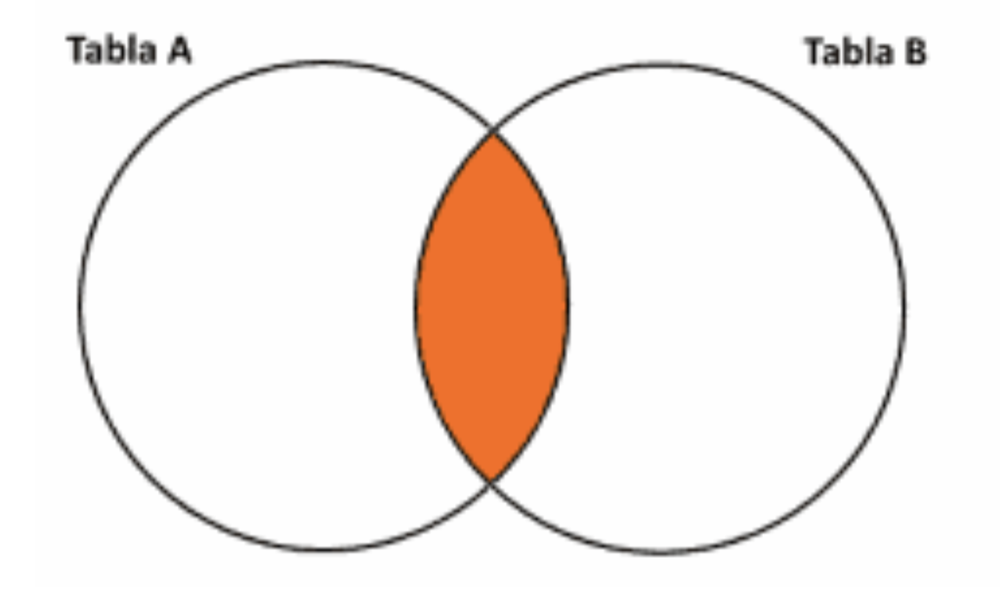
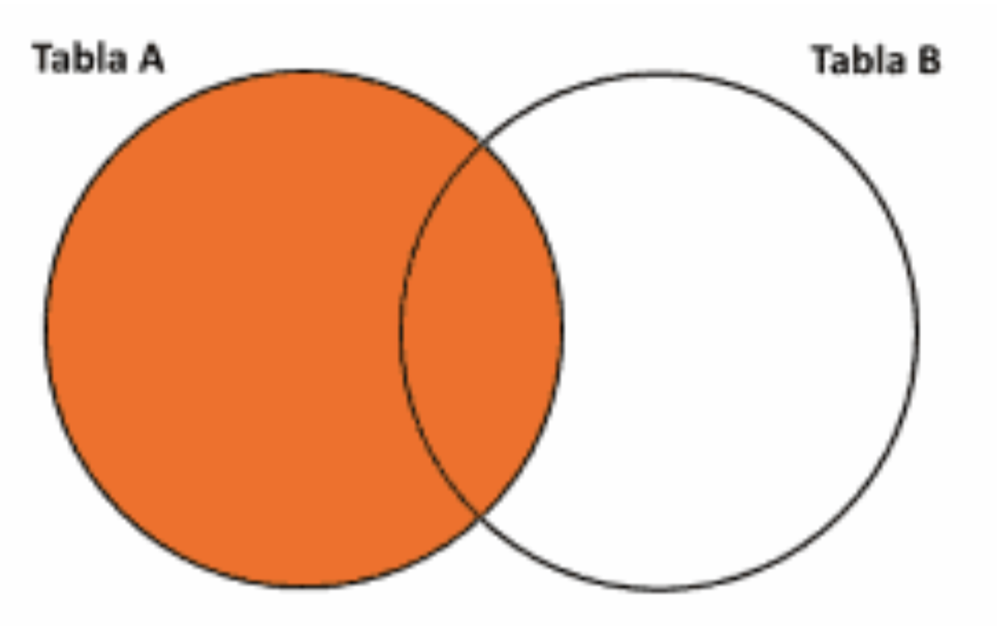
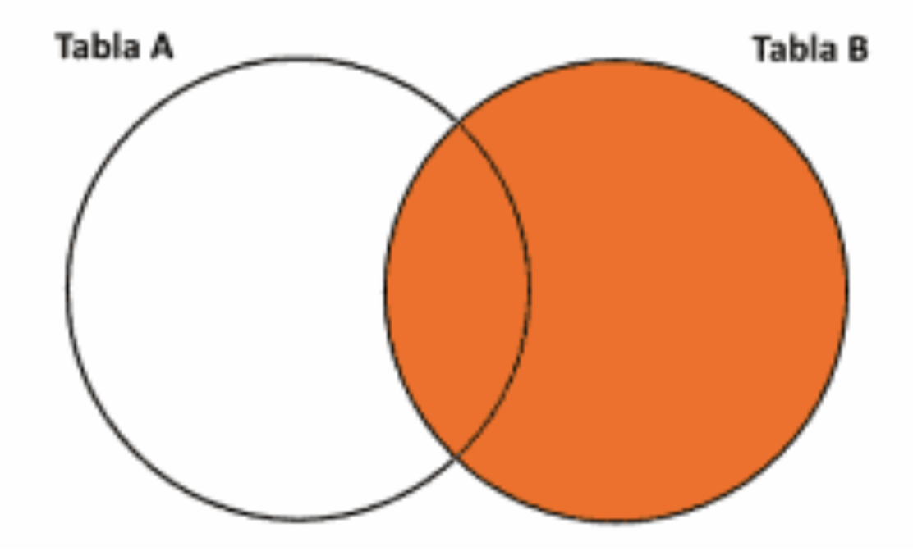
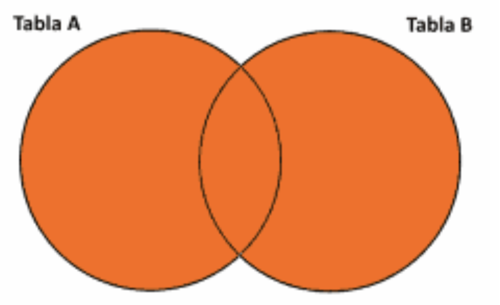

## Primera parte

### 1. ¿A qué se denomina JOIN en una base de datos?

### 2. Nombre y explique 2 tipos de JOIN.

### 3. ¿Para qué se utiliza el GROUP BY?

### 4. ¿Para qué se utiliza el HAVING?

### 5. Dado los siguientes diagramas indique a qué tipo de JOIN corresponde cada uno:

    

      
       
    

    

      <b>Intersección (A∩B)</b>
      <b>Diferencia (A-B)</b>
    

<table>
  <tr>
    <td>First Screen Page</td>
     <td>Holiday Mention</td>
  </tr>
  <tr>
    <td></td>
    <td></td>
  </tr>
 </table>

  

  <b>Diferencia (B-A)</b>

  

  <b>Unión (AUB)</b>

